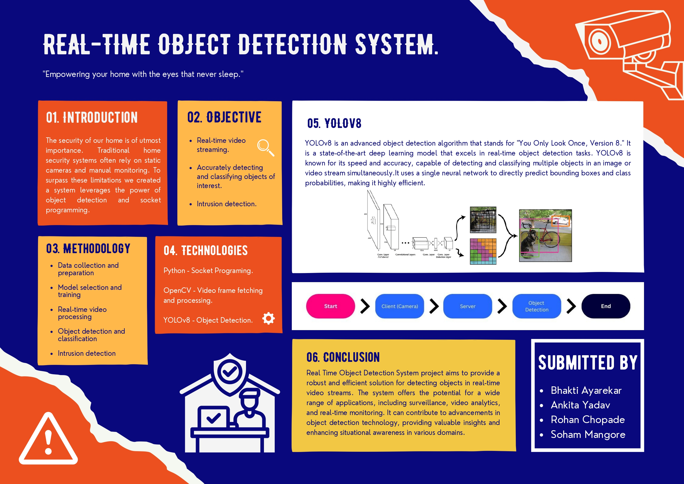

# Real-Time-Object-Detection

⭐Buit with Python along with integration of YOLOv8 model for Object Detection and using socket programming, the system allows clients to transmit their video frames to a server for efficient object detection processing. The server performs the object detection algorithm on the received frames and annotates the detected objects.🤓



### Note:🧐

- The required libraries are mentioned in the 'requirements.txt'. You can run the following command-

  ```
  pip install -r requirements.txt
  ```

  OR, just install them separately 😄.

- Before installing the required libraries, create a separate environment for the project, using the command-

  ```
  python -m venv evironment_name
  ```

  then activate the environment using this command-

  ```
  .\environment_name\Scripts\activate
  ```

- If the YOLOv8l model is to heavy for your system or if u want any other version of the yolov8 then just change the file and it's location from the 'server.py' file 😉.

- Make sure to run the 'server.py' file first and also change the IP in the 'client.py' file, as the code only works for the devices connected to the same wifi network 😇.
